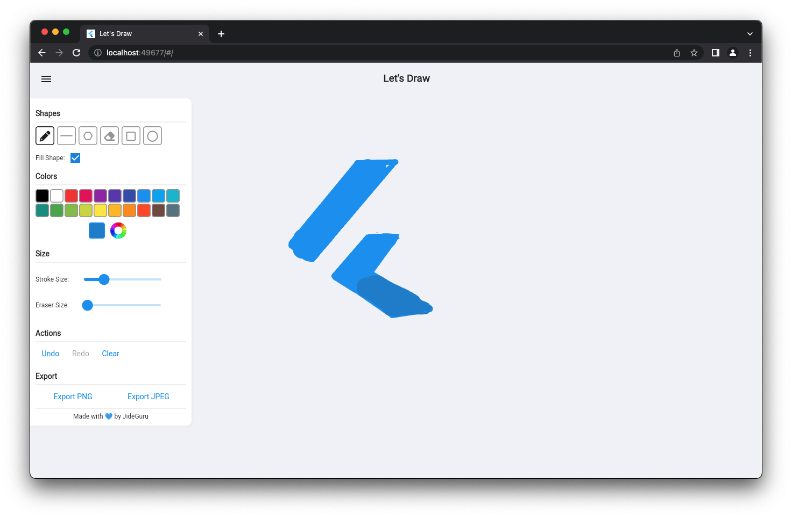
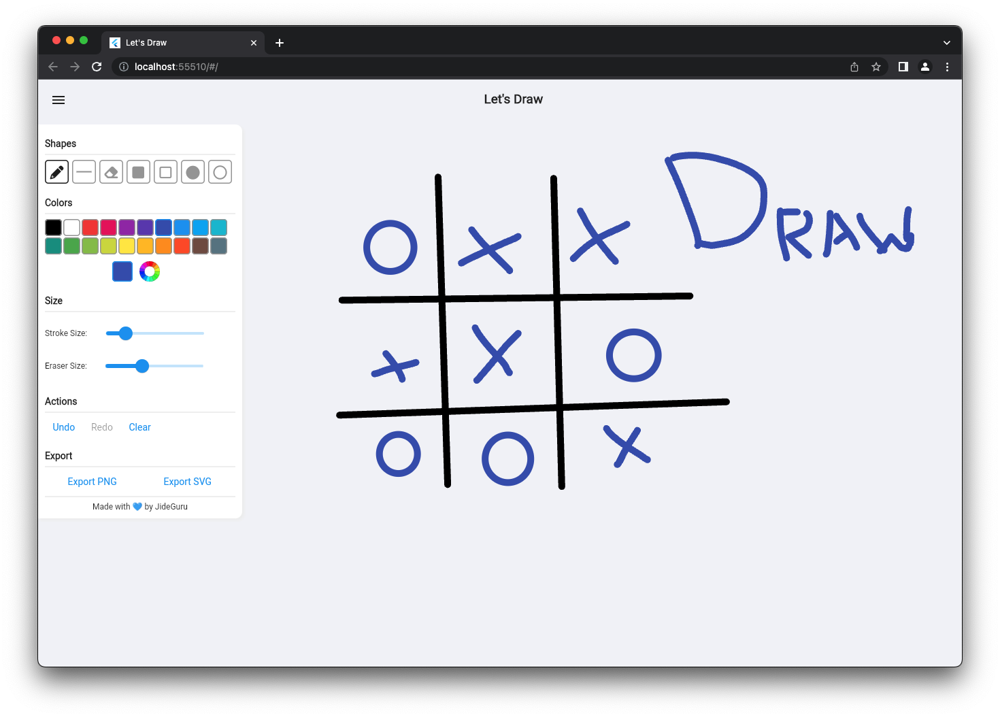

# 🎨🎨Let's Draw

A simple drawing app made with Flutter
Try out the DEMO here

## 💻 Requirements

- Any Operating System (ie. MacOS X, Linux, Windows)
- Any IDE with Flutter SDK installed (ie. IntelliJ, Android Studio, VSCode etc)
- A little knowledge of Dart and Flutter

## ✨ Features

#### Available Features
- [x] Scribble.
- [x] Draw Shapes (Line, Polygon, Ellipse and Rectangle).
- [x] Eraser.
- [x] Undo and Redo
- [x] Export as Image

#### Features to Explore
- [ ] Canvas Zoom/Scroll.
- [ ] Perfect circle option and Polygon rotation.
- [ ] Move doodle and shapes around the canvas

## 📸 ScreenShots

## 🤓 Author(s)

Harsh Rao

